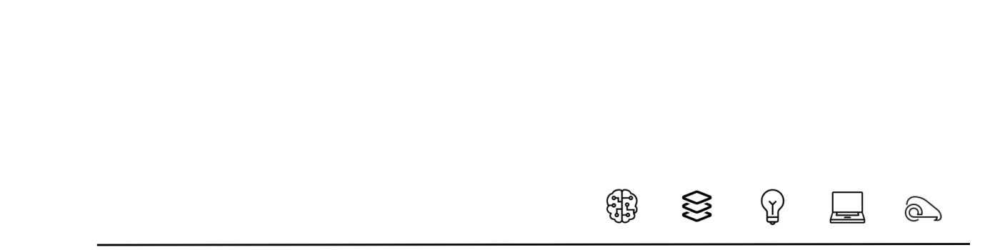

  <h1>Hi there 👋 I'm Ramiro Avila 🧑‍💻</h1>

  <h2> Systems Engineering Student at UIS :white_check_mark: </h2>

Systems Engineering student passionate about Computer Vision and Deep Learning. I am constantly looking for new opportunities to apply my knowledge in web and mobile application development, as well as in the exploration of artificial intelligence models and applications.🚀

- 💬 Talking about Deep Learning, AI, Computer Vision, Robotics
- :fire: Now I am learning Next.js
- :bulb: Passionate about technology

  
  
  
  

<h2>📊 Ramiro's GitHub Stats</h2>

